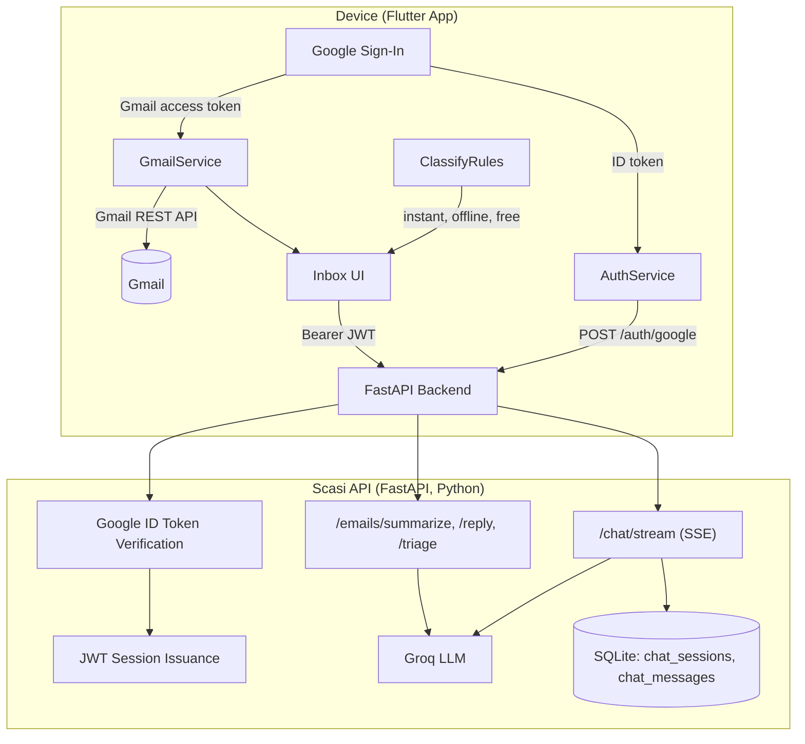

# Scasi Mobile

A Flutter client for [Scasi AI](https://github.com/shreysherikar/Scasi-AI) — connects
a real Gmail inbox and a custom FastAPI backend to deliver AI-powered email
classification, summarization, reply drafting, inbox triage, and a streaming
conversational assistant.

> **Status**: Actively developed. Auth is currently Google Sign-In + a custom JWT
> issued by the FastAPI backend (see [Roadmap](#-roadmap) for the planned move to
> Supabase-backed auth/persistence, matching the original Scasi-AI web backend).

---

## 🏛 System Architecture



---

## 📱 Tech Stack & Component Responsibilities

| Layer | Technologies | Responsibilities |
|---|---|---|
| **Mobile App** | Flutter, Dart, `google_sign_in`, `flutter_secure_storage`, `http` | Google auth, direct on-device Gmail fetch, chat UI with live streaming trace, inbox/triage UI |
| **Backend API** | Python, FastAPI, `pyjwt`, `google-auth`, SQLite | Google ID token verification, session JWT issuance, Groq-backed AI endpoints, chat history persistence |
| **AI Layer** | Groq (OpenAI-compatible chat completions, streaming) | Email summarization, reply drafting, inbox triage, conversational assistant — prompts ported verbatim from the original Scasi-AI TypeScript backend |
| **Local Logic** | Dart (`classify_rules.dart`) | Free, instant, offline keyword-based email categorization — no LLM call, no network — ported 1:1 from the original backend's rule engine |

---

## 📂 Project Structure

```
scasi-mobile/
├── app/                              # Flutter client
│   └── lib/
│       ├── config/env.dart           # Backend URL + Google OAuth client config
│       ├── models/                   # Email, chat stream event models
│       ├── services/
│       │   ├── auth_service.dart     # Google Sign-In + backend session exchange
│       │   ├── gmail_service.dart    # Direct Gmail REST API calls
│       │   ├── backend_client.dart   # HTTP client for the Scasi API, JWT-authenticated
│       │   ├── chat_service.dart     # SSE stream parser (intent/step/token/done)
│       │   ├── email_actions_service.dart  # Summarize/reply/triage calls
│       │   └── classify_rules.dart   # Local, offline categorization rule engine
│       └── screens/                  # Login, Home, Inbox, Email detail, Chat, Settings
│
└── backend/                          # FastAPI backend
    └── app/
        ├── main.py                   # App entry, CORS, route registration
        ├── auth.py                   # Google ID token verification, JWT issuance
        ├── db.py                     # SQLite persistence (users, chat sessions/messages)
        ├── groq_client.py            # Groq JSON-mode + streaming completions
        ├── prompts.py                # System prompts (ported from Scasi-AI backend)
        ├── classify.py               # Server-side classification + intent routing
        ├── schemas.py                # Pydantic request/response models
        └── routers/                  # auth.py, emails.py, chat.py
```

---

## 🛠 Getting Started

### Prerequisites
- Flutter SDK (`flutter --version`)
- Python 3.10+
- A free [Groq API key](https://console.groq.com)
- A Google Cloud OAuth Web client ID (shared between app and backend)

### 1. Run the backend
```bash
cd backend
python -m venv .venv && source .venv/bin/activate   # Windows: .venv\Scripts\activate
pip install -r requirements.txt
cp .env.example .env   # fill in GROQ_API_KEY and GOOGLE_CLIENT_ID
uvicorn app.main:app --host 0.0.0.0 --port 8000
```
Confirm it's healthy at `http://localhost:8000/docs`.

### 2. Run the app
```bash
cd app
flutter create .   # first time only, generates android/ ios/
flutter pub get
flutter run \
  --dart-define=API_BASE_URL=http://10.0.2.2:8000 \
  --dart-define=GOOGLE_SERVER_CLIENT_ID=<your-web-client-id>.apps.googleusercontent.com
```
`10.0.2.2` reaches your host machine's `localhost` from the Android emulator.
For a physical device or a public demo, deploy the backend (Render config
included) or tunnel it (`ngrok http 8000`) and use that URL instead.

---

## 🧪 Verification

| Check | Method | Result |
|---|---|---|
| Backend liveness | `GET /health` | ✅ `{"status": "ok"}` |
| Auth rejection (invalid token) | `POST /auth/google` with a malformed token | ✅ Returns `401` with a clear error, not a crash |
| Endpoint auth gating | `POST /emails/classify` with no bearer token | ✅ Returns `401` |
| Classification | `POST /emails/classify` with an authenticated request | ✅ Correct category returned |
| Chat streaming end-to-end | App → backend → Groq, live device test | ✅ SSE trace (`intent` → `step` → `token` → `done`) confirmed on-device |
| Session persistence | SQLite chat history across requests | ✅ Verified via direct DB read after a chat exchange |

---

## 📜 Development Principles

1. **No secrets on-device.** The Groq API key lives only on the backend — the
   app never sees or stores it.
2. **Prompts are ported, not reinvented.** Summarize/reply/triage system
   prompts are copied verbatim from the original Scasi-AI TypeScript backend,
   so behavior stays consistent with the documented project.
3. **Honest scope.** The chat trace is a lightweight, keyword-based intent
   router driving a real streaming LLM call — not the full multi-agent
   tool-calling/RAG orchestrator from the original web backend. Stated plainly
   rather than implied.

## 🗺 Roadmap

- [ ] Swap custom JWT auth for Supabase Auth, matching the original backend
- [ ] Gmail send/reply (currently read-only; drafts are shown in-app)
- [ ] Vector search (RAG) over indexed email history
- [ ] Multi-agent tool-calling orchestrator for chat
